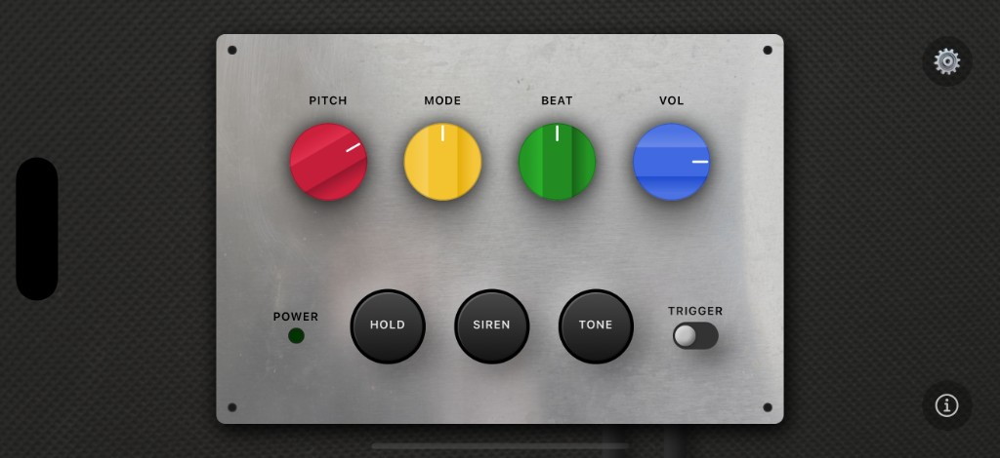

# Dub Siren – NJD Style
[🌐 GitHub Pages](https://eduardo-dangelo.github.io/dub-siren/)

**Sound System Synth.** The legendary dub siren, in your pocket. Analog sound system tones.

>Inspired by classic Jamaican sound systems, **Dub Siren - NJD Style** captures the raw, hands-on feel of hardware siren boxes – tuned for live performance and studio sessions.

## Features

**Classic dub siren controls.**

- **Authentic analog character** 
- **Four independent waveforms** 
- **Trigger & Hold**
- **Beat & Pitch control**
- **Global output control**
- **Siren & Tone**

## Getting started

To use Dub Siren localy - NJD Style, you'll need a React Native environment set up.  
See the official [React Native Getting Started guide](https://reactnative.dev/docs/environment-setup) for setup help.
