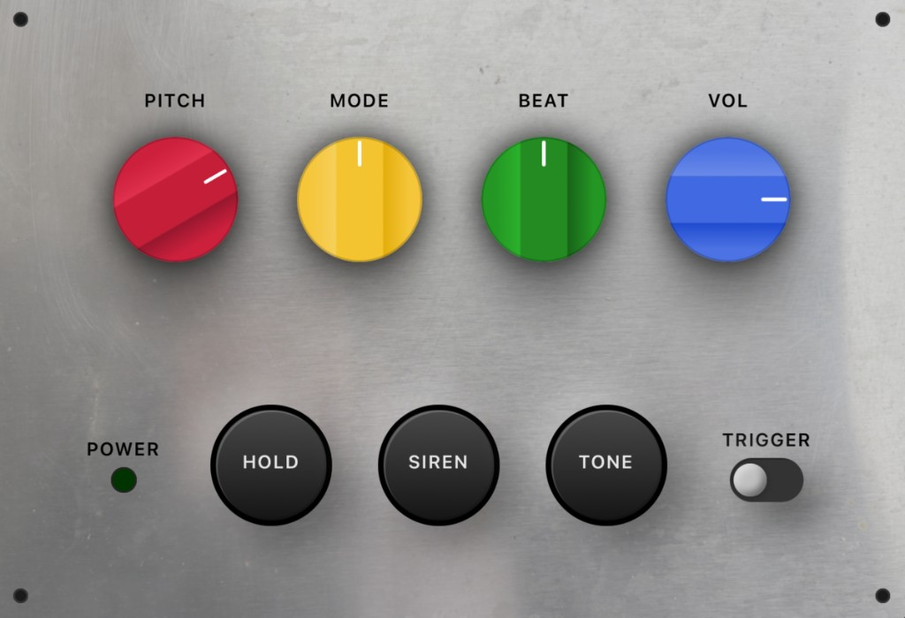
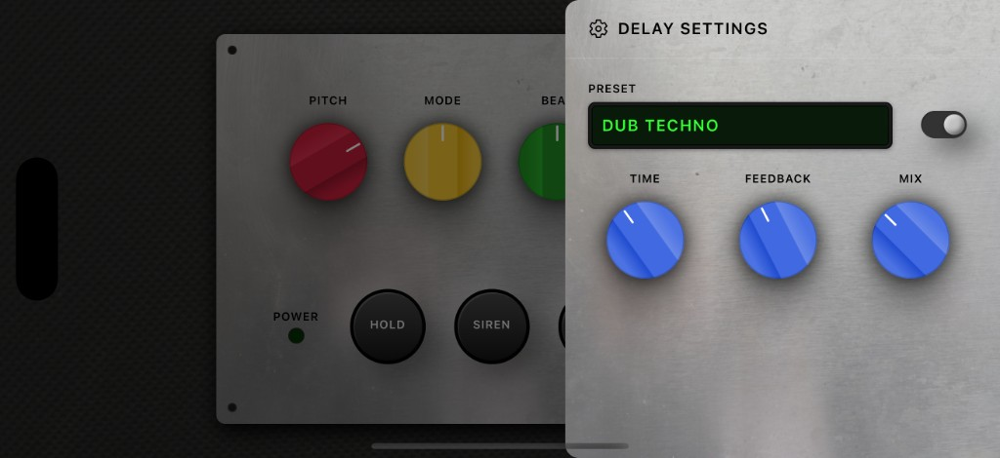

# Dub Siren – NJD Style

**Sound System Synth.** The legendary dub siren, in your pocket. Analog sound system tones.

Inspired by classic Jamaican sound systems, **Dub Siren - NJD Style** captures the raw, hands-on feel of hardware siren boxes – tuned for live performance and studio sessions.



---

## Table of contents

- [Features](#features)
- [Built-in delay](#built-in-delay)
- [Screenshots](#screenshots)
- [Getting started](#getting-started)
- [Usage](#usage)
- [Project status](#project-status)
- [Contributing & license](#contributing--license)

---

## Features

**Classic dub siren controls.** Dial in siren sweeps, trigger stabs, and evolving textures that cut through any sound system.

- **Authentic analog character** — Carefully tuned waveforms to sit like a real hardware siren in the mix.
- **Four independent waveforms** — Switch between sine, square, triangle, and sawtooth with the MODE control.
- **Trigger & Hold** — Tap, latch, or hold notes using dedicated TRIGGER and HOLD controls.
- **Beat & Pitch control** — Shape evolving sweeps and patterns with BEAT speed and PITCH range.
- **Global output control** — Quickly match levels to your rig with a global VOL knob.
- **Siren & Tone** — Engage the Siren and Tone buttons for unique effects when BEAT is set to its fourth position.

---

## Built-in delay

**Shape echoes that melt into the riddim.**

Dub Siren - NJD Style includes a dedicated delay section with presets tuned for classic dub textures.

- Choose from curated presets or dial in your own.
- Use **TIME**, **FEEDBACK**, and **MIX** to sit the echo where you want it.



---

## Screenshots

| Main siren UI | Delay settings |
|---------------|----------------|
|  |  |

---

## Getting started

### Requirements

- **Node.js** 18+ (or as required by [Expo](https://expo.dev))
- **npm** (or pnpm/yarn)

### Install and run

```bash
# Clone the repo
git clone https://github.com/eduardodangelo/dub-siren.git
cd dub-siren

# Install dependencies
npm install

# Run the app (Expo)
npm start
```

Then:

- **Web:** Run `npm run web` or choose “Run in web browser” from the Expo CLI.
- **iOS / Android:** Use the Expo Go app and scan the QR code, or run `npm run ios` / `npm run android` with a local simulator/device.

The **landing page** (marketing site) lives in the `landing/` folder and can be deployed separately (e.g. `npm run deploy-landing` for GitHub Pages).

---

## Usage

Once the app is running:

1. **Trigger** notes with the main trigger control; use **Hold** to latch or sustain.
2. Adjust **BEAT** and **PITCH** to shape sweeps and patterns.
3. Switch **MODE** to change waveform (sine, square, triangle, sawtooth).
4. Use the **Siren** and **Tone** buttons when BEAT is in the fourth position for extra character.
5. Open the delay section to add **TIME**, **FEEDBACK**, and **MIX** for classic dub echoes.

---

## Project status

- **Download coming soon** — Native app distribution (e.g. App Store / Play Store) is planned.
- The app runs today via Expo (web, iOS, Android in development builds or Expo Go).

---

## Contributing & license

Contributions are welcome. Open an issue or submit a pull request on [GitHub](https://github.com/eduardodangelo/dub-siren).

© Dub Siren - NJD Style.
